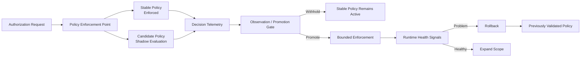

# Shadow–Observe–Restrict (SOR)

Shadow–Observe–Restrict (SOR) is a reference implementation of a staged authorization-remediation workflow for introducing least-privilege policy reductions with bounded operational risk.

Rather than enforcing a proposed reduction immediately, SOR separates rollout into three stages:

1. **Shadow** — evaluate the candidate policy alongside the stable policy without changing production decisions.
2. **Observe** — inspect policy differences and apply configurable promotion criteria.
3. **Restrict** — introduce the candidate to a bounded scope while monitoring runtime signals and retaining a previously validated policy for rollback.

This repository accompanies the practitioner article **“Shadow Before You Restrict: A Safer Path to Least-Privilege Authorization.”** It is intended as a readable reference implementation and reproducibility package, not as a production IAM product.

## Quick start — 5 minutes

Python 3.10 or newer is required.

```bash
python3 -m venv .venv
source .venv/bin/activate
python3 -m pip install --upgrade pip
python3 -m pip install -r requirements.txt
python3 examples/run_demo.py
```

The quick demo intentionally uses a small deterministic synthetic replay so that the SOR mechanism can be inspected quickly. It is **not** the 50,000-request controlled experiment discussed in the article.

Example output:

```text
Candidate: over-aggressive
Promotion decision: WITHHOLD
Reason: required-access conflicts observed

Candidate: lower-risk
Promotion decision: PROMOTE
Reason: configured promotion criteria satisfied
```

Exact counts depend on the configured request count.

## Architecture blueprint



The diagram is deliberately implementation-neutral. The reference code includes one small service-level realization, but FastAPI, Docker, and the storage choices are not part of the SOR pattern itself.

## Operational scenarios

### Over-aggressive permission reduction

The first example removes permissions that the synthetic workload labels as required. During shadow evaluation, the configured gate observes required-access conflicts and withholds promotion, leaving the stable policy in force.

### Lower-risk permission reduction

The second example removes only an entitlement labeled redundant by the synthetic workload. The candidate still differs from the stable policy, but the observed differences do not affect required synthetic requests, so the example gate allows promotion.

These scenarios demonstrate control-loop behavior. They do not establish that SOR can determine which permissions are globally safe to remove in a production environment.

## Reproducing the article example

To reproduce the 50,000-request controlled experiment discussed in the article, run:

```bash
python3 experiments/run_primary_experiment.py --requests 50000 --seed 2026
```

This is intentionally separate from `examples/run_demo.py`: the quick demo is for understanding the mechanism; the experiment command is for reproducing the article-facing evidence.

Optional threshold and scale sensitivity experiments:

```bash
python3 experiments/run_sensitivity_experiments.py
```

Distributed propagation example:

```bash
python3 experiments/simulate_distributed_run.py
python3 experiments/make_supporting_figures.py
```

Validate the complete generated result set after running the primary, sensitivity, and propagation experiments:

```bash
python3 experiments/validate_results.py
```

For the simplest end-to-end reproduction and validation path, run:

```bash
bash scripts/run_all.sh
```

Generated aggregate results are written to `results/summary/`. Large request-level outputs are generated locally under `results/raw/` and are intentionally not committed.

## Promotion gates in the reference implementation

The controlled replay uses three signals during observation:

- disagreement between stable and candidate decisions;
- candidate denials of requests labeled required by the synthetic workload; and
- candidate permission expansions.

These thresholds are **example experimental parameters, not recommended production defaults**. A production rollout should additionally consider workload criticality, observation coverage, service-owner validation, application health, emergency-access paths, and the organization's failure-isolation boundary.

## Distributed rollback

The repository includes a deterministic three-node propagation simulation. It demonstrates that a rollback decision can precede rollback convergence: enforcement points may temporarily observe different policy versions while restoration propagates.

See [`docs/DESIGN_AND_LIMITATIONS.md`](docs/DESIGN_AND_LIMITATIONS.md) for the model and claim boundaries.

## Repository layout

```text
.
├── examples/                  # Small practitioner-facing demonstrations
├── controller/                # Rollout controller prototype
├── auth_node/                 # Example distributed authorization node
├── telemetry/                 # Telemetry collection and metrics helpers
├── replay/                    # Replay utilities
├── parsers/                   # Optional configuration parsers
├── datasets/
│   ├── examples/              # Stable, required, and candidate policies
│   └── derived_graphs/        # Small configuration-derived examples
├── experiments/               # Controlled experiments and validation
├── results/
│   └── summary/               # Committed aggregate reference outputs
├── docs/                      # Design, limitations, and reproducibility notes
└── scripts/                   # Environment and utility scripts
```

## Detailed evaluation material

The root README intentionally keeps research-style detail out of the main path. The complete controlled-experiment description, scale/threshold sensitivity, propagation behavior, and claim boundaries live in:

- [`docs/EVALUATION_DETAILS.md`](docs/EVALUATION_DETAILS.md)
- [`docs/REPRODUCIBILITY.md`](docs/REPRODUCIBILITY.md)
- [`docs/DESIGN_AND_LIMITATIONS.md`](docs/DESIGN_AND_LIMITATIONS.md)

`results/summary/` contains compact aggregate reference outputs. Request-level outputs are regenerated locally.

## Optional service-level demonstration

A FastAPI/Docker implementation is included only as a service-level demonstration of controller/node interaction:

```bash
bash scripts/run_docker_demo.sh
```

The service endpoints are intentionally minimal and are not authenticated or production-hardened. The implementation stack is not part of the SOR contribution.

## Optional public configuration example

The repository contains parsers for selected public cloud-native configuration structures. They perform static extraction only and do not supply production request frequencies or business semantics.

See [`docs/PUBLIC_CONFIG_EXAMPLE.md`](docs/PUBLIC_CONFIG_EXAMPLE.md).

## Citation

Citation metadata is provided in [`CITATION.cff`](CITATION.cff). Article publication details will be added after publication.

## License

Licensed under the Apache License 2.0. See [`LICENSE`](LICENSE).
